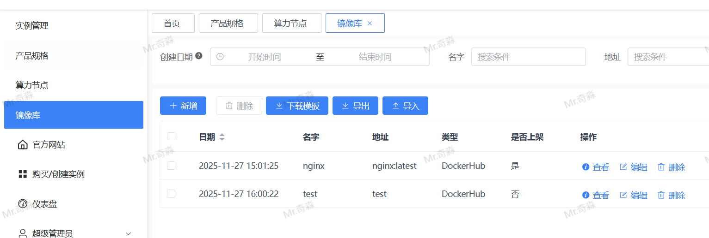
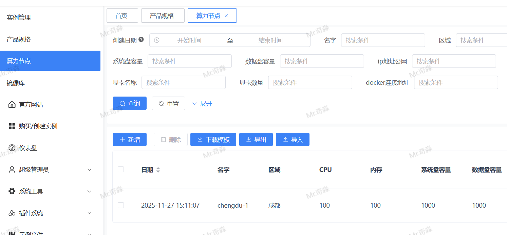
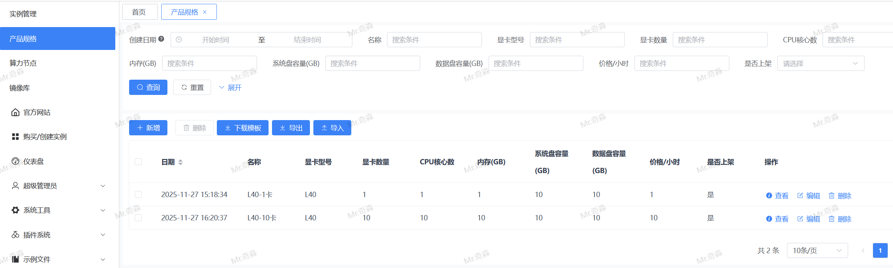
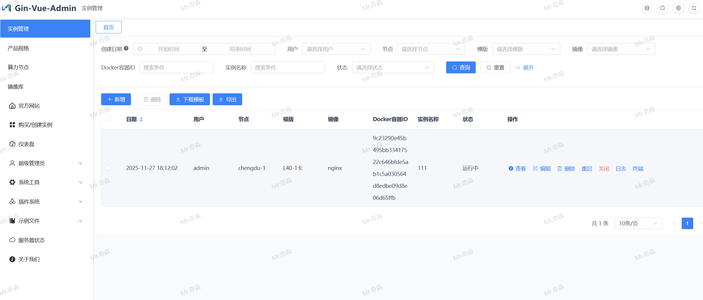

# DockerGPU
> 基于Docker的GPU 算力租赁系统






## 已开发功能模块

- 镜像库
  - 字段：名称、地址、描述、类型、是否上架(bool，默认上架)、备注
  - 后端：`server/model/registry/registry.go`；自动迁移与路由已注册
  - 前端：`web/src/view/registry/registry/registry.vue`，列表/表单，`是否上架`为开关控件
  - 兼容性修正：移除数据库枚举写法，采用布尔字段，避免 MySQL 语法问题

- 算力节点
  - 字段：名称(必填)、区域、CPU、内存、系统盘容量、数据盘容量、公网IP(必填)、内网IP(必填)、SSH端口(必填，默认22)、用户名、密码、显卡名称、显卡数量、Docker连接地址、使用TLS(bool，默认启用)、CA证书(TEXT)、客户端证书(TEXT)、客户端私钥(TEXT)、是否上架(bool，默认上架)、备注
  - 后端：`server/model/compute/computenode.go`；自动迁移与路由已注册
  - 前端：`web/src/view/compute/computeNode/computeNode.vue`，布尔项使用开关控件；证书为富文本编辑/查看

- 产品规格
  - 字段：名称(必填)、显卡型号(必填)、显卡数量、CPU核心数、内存(GB)、系统盘容量(GB)、数据盘容量(GB)、价格/小时(float64)、是否上架(bool，默认上架)、备注
  - 后端：`server/model/product/productSpec.go`；自动迁移与路由已注册
  - 前端：`web/src/view/product/productSpec/productSpec.vue`，价格使用数值输入，`是否上架`为开关控件

- 实例管理
  - 字段：所属用户ID(后端创建时自动填写)、来源服务器ID(算力节点)、来源模版ID(产品规格)、来源镜像ID(镜像库)、Docker容器ID(后端创建后回填)、实例名称、状态(创建中/运行中/停止/异常)、备注
  - 状态字典：`instance_status`（创建中/运行中/停止/异常）
  - 后端：`server/model/instance/instance.go`；创建接口自动从认证信息写入用户ID；状态使用字符串并默认 `creating`
  - 前端：`web/src/view/instance/instance/instance.vue`，来源ID下拉，状态字典选择；显示标签统一为“用户/节点/模版/镜像”
  - 容器操作：重启容器、关闭容器、查看日志、交互式终端
    - 重启：`POST /inst/restartContainer`
    - 关闭：`POST /inst/stopContainer`
    - 日志：`GET /inst/getContainerLogs?ID=<id>&tail=100`（前端自动每2秒刷新，只显示最后100行）
    - 终端：`GET /inst/terminal?ID=<id>&token=<jwt>`（WebSocket，后端通过 Docker SDK ExecAttach 透传二进制流）
  - 权限策略：非管理员仅能操作自己创建的实例，管理员可操作所有
  - 删除约束：删除实例时必须先删除容器；容器未删除成功则删除实例报错
  - 状态同步：列表查询时自动 inspect 容器状态并更新数据库；操作后也会刷新状态

## 运行与架构要点

- 前后端分离，后端端口默认 `8888`，前端开发端口默认 `8080`
- Vite 代理已启用 WebSocket：`web/vite.config.js` 中对 `VITE_BASE_API` 的代理设置 `ws: true`
- 前端环境：`web/.env.development`
  - `VITE_CLI_PORT=8080`
  - `VITE_SERVER_PORT=8888`
  - `VITE_BASE_API=/api`
  - `VITE_BASE_PATH=http://127.0.0.1`
- 终端实现：后端接入 Docker SDK 的 `ExecCreate + ExecAttach`（TTY），前端 xterm.js 使用二进制流进行交互
- 证书：算力节点支持 TLS，CA/客户端证书/私钥均以 TEXT 存储，后端按需加载

## 初始化步骤（数据库与配置）

1. 数据库初始化（以 MySQL 为例）：

```sql
-- 创建数据库与用户（示例）
CREATE DATABASE IF NOT EXISTS gva DEFAULT CHARACTER SET utf8mb4 COLLATE utf8mb4_general_ci;
CREATE USER IF NOT EXISTS 'gva'@'%' IDENTIFIED BY 'gva123456';
GRANT ALL PRIVILEGES ON gva.* TO 'gva'@'%';
FLUSH PRIVILEGES;
```

2. 配置后端数据库连接：编辑 `server/config.yaml`，设置数据库为上面创建的 `gva`

3. 后端自动迁移：
   - 业务模型在 `server/model/` 下，初始化文件位于：
     - 路由注册：`server/initialize/router_biz.go`
     - 自动迁移：`server/initialize/gorm_biz.go`
   - 首次启动后会自动创建所需数据表（包括镜像库、算力节点、产品规格、实例等）

4. 算力节点配置：在前端“算力节点”页面填写 Docker 连接地址与证书（如使用 TLS），并启用“是否上架”

5. 镜像与规格：在“镜像库”“产品规格”页面按需上架对应项，实例创建时选择来源镜像与规格

## 项目启动

后端：

```bash
# 进入后端目录
cd server

# 拉取依赖（Go 1.23）
go mod tidy

# 启动（默认端口 8888）
go run main.go
```

前端：

```bash
# 进入前端目录
cd web

# 安装依赖（建议使用官方 npm 源）
npm install --registry=https://registry.npmjs.org

# 启动开发模式（默认端口 8080）
npm run dev

# 打开 http://localhost:8080/
```

注意：
- 若使用交互式终端（WebSocket），确保前端代理已开启 `ws: true`，并在终端地址中附带登录 token（自动从前端用户状态注入）
- 非管理员用户的操作范围仅限本人实例；越权操作会在后端被拒绝

## API 权限与安全

- 已注册的实例操作接口：
  - `POST /inst/restartContainer`
  - `POST /inst/stopContainer`
  - `GET /inst/getContainerLogs`
  - `POST /inst/execContainerCmd`
  - `GET /inst/terminal`
- 权限记录已在系统中创建，请在角色管理中为对应角色赋予使用权限
- 建议对终端命令交互进行审计与白名单控制（按业务需要扩展）

## 路由与迁移

- 路由组注册：`server/initialize/router_biz.go`
- 自动迁移：`server/initialize/gorm_biz.go`

## 前端运行

- 开发模式：`web/package.json` 中 `dev` 脚本 `vite --host --mode development`

## 说明

- 布尔字段统一以 `bool` 类型持久化，前端以开关控件展示
- 证书内容使用 `TEXT` 列，前端提供富文本编辑/查看组件
- 实例创建时，所属用户ID自动填充为当前登录用户；列表/搜索仍支持按用户筛选
