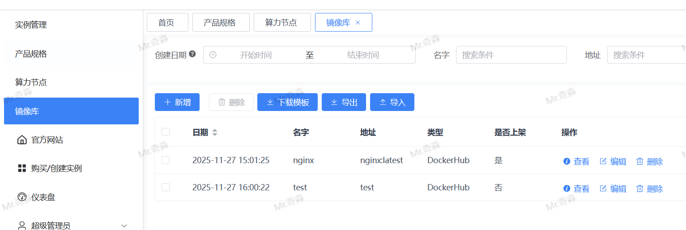
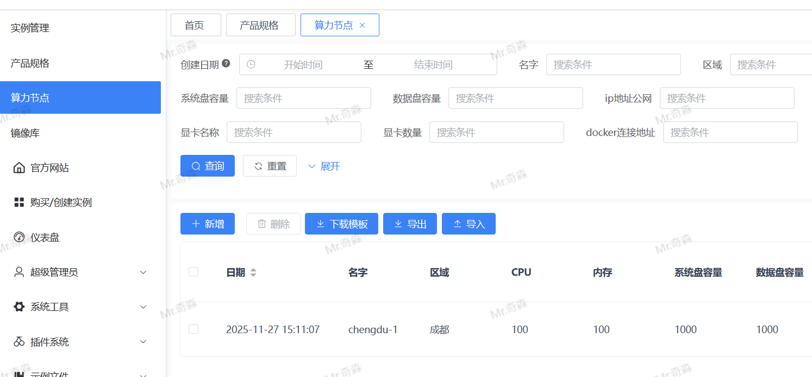
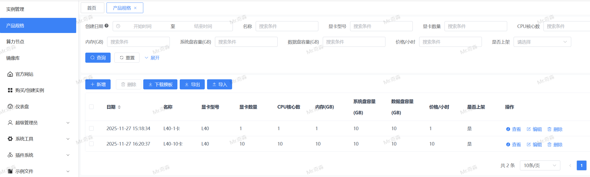
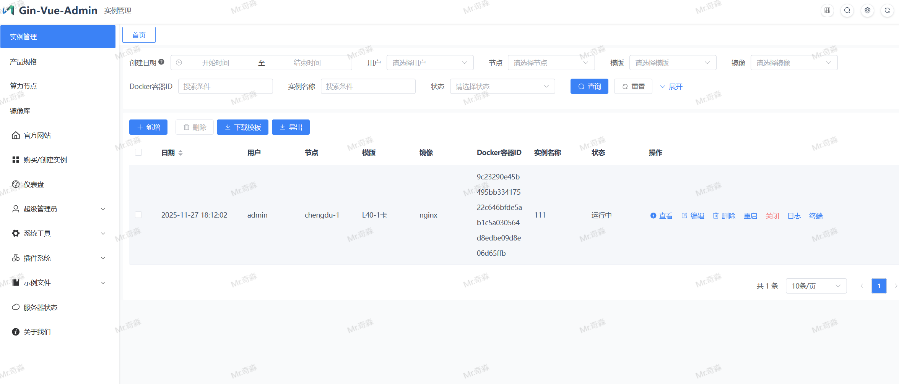

[简体中文](README.md) | [English](README.en.md)

# DockerGPU

> 基于 Docker 的 GPU 算力租赁系统


## 项目介绍

DockerGPU 是一套前后端分离的 GPU 算力租赁/管理平台：管理员把装有显卡的服务器登记为**算力节点**（通过 Docker API 远程连接，支持 TLS 双向证书），再按显卡型号、CPU、内存、磁盘等维度定义**产品规格**上架出租。用户下单时选择镜像与规格，系统自动匹配满足剩余算力的节点，并在对应节点上创建带资源限制的 Docker 容器，形成一台可直连操作的"GPU 实例"。

平台内置完整的实例生命周期管理：容器的启动、重启、停止、日志查看、命令执行与 **Web 交互式终端**（xterm.js + WebSocket），容器状态随操作与列表查询自动同步。普通用户只能看到并操作自己创建的实例，管理员（authority 888）可管理所有用户的实例，天然适合内部算力共享、小团队 GPU 出租、教学实验环境分发等场景。

项目基于 [gin-vue-admin](https://github.com/flipped-aurora/gin-vue-admin) 2.8.6 脚手架二次开发，继承了用户/角色/API 权限（Casbin）、菜单管理、操作记录、代码生成器、表单设计器、插件机制、多云对象存储等全套后台能力，业务部分（镜像库、算力节点、产品规格、实例管理）为定制开发。

## ✨ 功能特性

- **镜像库管理**：维护可出租的容器镜像（名称、地址、描述、类型），支持上架/下架开关
- **算力节点管理**：登记 GPU 服务器（区域、CPU、内存、系统盘/数据盘容量、公网/内网 IP、SSH 信息、显卡名称与数量），配置 Docker 连接地址，支持 TLS（CA 证书、客户端证书、私钥）加密连接
- **产品规格管理**：按显卡型号/数量、CPU 核数、内存、磁盘容量定义出售规格，支持按小时定价与上架控制
- **实例一键创建**：通过 Docker API 在选中节点创建并启动容器，自动按规格注入资源限制
  - CPU `NanoCPUs`、内存 `Memory`、系统盘 `StorageOpt` 限额
  - NVIDIA GPU 直通（`DeviceRequests`，指定显卡数量），并注入 `GPU_MODEL` / `GPU_COUNT` 环境变量与规格 Labels
  - 系统盘/数据盘以命名卷挂载到容器 `/system`、`/data`
  - 创建成功自动回填容器 ID，状态置为运行中；失败自动落库为异常
- **节点智能匹配**：创建实例时按规格需求（显卡型号/数量、CPU、内存、磁盘）筛选已上架节点，并**扣减已创建实例占用的资源**后返回可选项
- **容器全生命周期操作**：重启容器、关闭容器、查看日志（`tail` 截取，前端每 2 秒自动刷新）、容器内执行命令
- **Web 交互式终端**：xterm.js 通过 WebSocket 连接后端，后端基于 Docker SDK `ExecCreate + ExecAttach`（TTY）透传二进制流，像 SSH 一样操作容器
- **容器状态自动同步**：列表查询与每次操作后自动 `inspect` 容器真实状态并回写数据库（创建中/运行中/已停止/异常）
- **多租户权限隔离**：普通用户仅能查询/操作自己创建的实例，管理员（authorityId 888）可管理全部；接口经 Casbin 鉴权，写操作自动记录操作日志
- **删除保护**：删除实例前必须先删除对应容器（连同挂载的数据卷一起删除），容器未删除成功则拒绝删除实例
- **继承 gin-vue-admin 完整后台能力**：RBAC 角色权限、菜单/API 管理、代码生成器、表单设计器、定时任务、插件机制（邮件/公告）、多种云存储上传（阿里云 OSS、腾讯云 COS、AWS S3、华为云 OBS、MinIO、Cloudflare R2、本地）、AI 辅助开发 MCP 工具等

## 🛠 技术栈

**后端**（`server/`，Go 1.23）

- Web 框架：[Gin](https://github.com/gin-gonic/gin) v1.10.0
- ORM：[GORM](https://github.com/go-gorm/gorm) v1.25.12（MySQL / PostgreSQL / SQLite / Oracle / SQL Server）
- 权限：Casbin v2.103.0 + JWT（golang-jwt/v5）
- 容器操作：[Docker SDK](https://github.com/moby/moby)（docker/docker v26.1.4），支持 TLS 连接远程节点
- 终端通信：gorilla/websocket
- 其他：Viper（配置）、Zap（日志）、Swagger（swaggo 文档）、go-redis、mark3labs/mcp-go（MCP 工具）

**前端**（`web/`）

- [Vue 3](https://github.com/vuejs/core) 3.5 + [Element Plus](https://github.com/element-plus/element-plus) 2.10
- 构建：Vite 6（开发代理已开启 `ws: true` 支持 WebSocket）
- 状态管理：Pinia 2.2；路由：Vue Router 4
- 终端：xterm 5.3（+ xterm-addon-fit）
- 其他：ECharts 5.5、UnoCSS、wangEditor 5、Axios 1.8.2

**部署**

- Dockerfile：`server/Dockerfile`（golang:alpine 多阶段构建）、`web/Dockerfile`（node:20 + nginx）
- 编排：`deploy/docker-compose/docker-compose.yaml`（web + server + MySQL 8 + Redis）、`deploy/kubernetes/`（K8s 清单）
- 构建：根目录 `Makefile`（容器内打包、镜像构建、Swagger 文档生成、插件打包）

## 🚀 快速开始

### 环境要求

- Go 1.23+、Node.js 20+、Docker
- MySQL 8（也支持配置其他 GORM 支持的数据库）
- 算力节点需安装 Docker 并暴露 Docker API（建议启用 TLS）

### 1. 初始化数据库（以 MySQL 为例）

```sql
-- 创建数据库与用户（示例）
CREATE DATABASE IF NOT EXISTS gva DEFAULT CHARACTER SET utf8mb4 COLLATE utf8mb4_general_ci;
CREATE USER IF NOT EXISTS 'gva'@'%' IDENTIFIED BY 'gva123456';
GRANT ALL PRIVILEGES ON gva.* TO 'gva'@'%';
FLUSH PRIVILEGES;
```

### 2. 启动后端（默认端口 8888）

```bash
cd server

# 编辑 config.yaml，配置上面创建的数据库连接（mysql 段：path/port/db-name/username/password）
# 业务表（镜像库、算力节点、产品规格、实例等）在首次启动时自动迁移创建

go mod tidy
go run main.go
```

### 3. 启动前端（默认端口 8080）

```bash
cd web
npm install --registry=https://registry.npmjs.org
npm run dev
```

打开 `http://localhost:8080/`，进入初始化页面完成数据库初始化后，使用默认管理员账号 `admin / 123456` 登录。

### 4. 配置算力并出租

1. 在「算力节点」页面登记 GPU 服务器：填写 Docker 连接地址（如 `tcp://1.2.3.4:2376`）与 TLS 证书（如启用），打开"是否上架"开关
2. 在「镜像库」上架要出租的镜像，在「产品规格」按显卡型号/数量、CPU、内存、磁盘定价上架
3. 创建实例时选择镜像与规格，系统自动匹配有剩余算力的节点并创建容器

### 前端环境变量（`web/.env.development`）

| 变量 | 说明 | 默认值 |
| --- | --- | --- |
| `VITE_CLI_PORT` | 前端开发端口 | `8080` |
| `VITE_SERVER_PORT` | 后端端口 | `8888` |
| `VITE_BASE_API` | 接口代理前缀 | `/api` |
| `VITE_BASE_PATH` | 代理目标地址 | `http://127.0.0.1` |

### Docker 部署

```bash
# 构建后端/前端镜像（tag 可用 TAGS_OPT 变量覆盖）
make build-image-server
make build-image-web

# 本地打包前后端产物并构建前后端二合一镜像
make image

# docker-compose 一键部署（web:8080 / server:8888 / mysql:13306 / redis:16379）
cd deploy/docker-compose
docker-compose up -d
```

Kubernetes 部署清单见 `deploy/kubernetes/`（含 ConfigMap、Deployment、Service、Ingress）。

### 实例操作接口

| 方法 | 路径 | 说明 |
| --- | --- | --- |
| POST | `/inst/createInstance` | 创建实例（用户 ID 取自登录态） |
| DELETE | `/inst/deleteInstance` | 删除实例（须先删除容器） |
| POST | `/inst/restartContainer` | 重启容器 |
| POST | `/inst/stopContainer` | 关闭容器 |
| POST | `/inst/execContainerCmd` | 容器内执行命令 |
| GET | `/inst/getContainerLogs?ID=&tail=` | 查看容器日志 |
| GET | `/inst/getMatchedComputeNodes` | 按规格匹配可用节点 |
| GET | `/inst/terminal?ID=&token=` | WebSocket 交互式终端（token 走查询参数鉴权） |

以上接口的权限记录已随初始化数据创建，可在「角色管理 → API 权限」中按需分配。建议对终端可执行命令做审计与白名单控制。

## 📁 目录结构

```
DockerGPU
├── server/                 # 后端（Go / Gin / GORM）
│   ├── api/v1/             # 接口层（system/example + registry/compute/product/instance）
│   ├── model/              # 模型层（registry 镜像库、compute 算力节点、product 产品规格、instance 实例）
│   ├── service/            # 服务层（实例服务含 Docker API 容器编排逻辑）
│   ├── router/             # 路由层（业务路由注册于 initialize/router_biz.go）
│   ├── initialize/         # 初始化（router_biz.go 路由注册、gorm_biz.go 自动迁移）
│   ├── mcp/                # AI 辅助开发 MCP 工具
│   ├── config.yaml         # 后端配置文件
│   └── Dockerfile
├── web/                    # 前端（Vue3 / Element Plus / Vite）
│   ├── src/view/           # 页面（registry/compute/product/instance 为业务页面）
│   ├── vite.config.js      # 开发代理（已开启 ws: true）
│   └── Dockerfile
├── deploy/                 # docker / docker-compose / kubernetes 部署文件
├── docs/                   # 截图
└── Makefile                # 构建/镜像/文档/插件打包
```

## 📸 截图






## 🔗 相关项目

- [gin-vue-admin](https://github.com/flipped-aurora/gin-vue-admin) —— 本项目基于的后台管理脚手架（Go + Vue3）

## 📄 License

本项目基于 [Apache License 2.0](./LICENSE) 开源。
